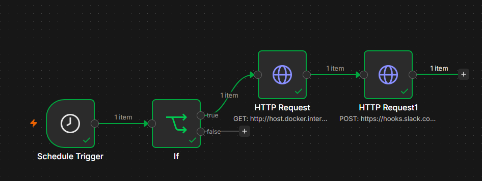
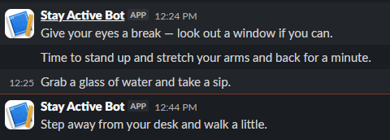

# Stay Active Bot

An automated workflow built with n8n and Python that sends randomized break reminders to Slack during work hours, encouraging regular breaks from screen and desk work.

---

## Overview

This project combines n8n, a local Python server, and Slack to deliver hourly break reminders:

- Runs automatically every hour, but only during work hours (9am-6pm, Monday-Friday)
- A local Python (Flask) server randomly selects a break reminder from four categories: stretch, eyes, hydrate, walk
- The selected reminder is sent to a dedicated Slack app via webhook

---

## Preview

**n8n Workflow Canvas**



**Slack Output**



---

## Tech Stack

| Tool | Purpose |
|---|---|
| n8n | Workflow automation engine (self-hosted locally via Docker) |
| Python (Flask) | Local server that generates randomized break reminder messages |
| Slack API | Incoming webhook for message delivery |

---

## How It Works

1. **Schedule Trigger** - fires once every hour.
2. **IF Node** - checks the current hour and day of week; only allows the workflow to continue if it is a weekday between 9am and 6pm.
3. **HTTP Request Node (Python)** - calls a local Flask server, which randomly selects a break reminder from one of four categories (stretch, eyes, hydrate, walk).
4. **HTTP Request Node (Slack)** - sends the selected reminder to a Slack channel via webhook.

---

## Getting Started

### Prerequisites

- n8n installed locally (this project uses a Docker setup)
- Python 3 installed, with Flask: `pip install flask`
- A Slack workspace with an Incoming Webhook set up for a dedicated app

### Setup

1. Clone this repository:
```bash
   git clone https://github.com/SaribAfzaal/stay-active-bot.git
   cd stay-active-bot
```

2. Start the Python server:
```bash
   python app.py
```
   This runs a local server on port 5001 that returns a random break reminder at the `/reminder` endpoint.

3. Import the workflow into n8n:
   - Open n8n
   - Go to Workflows -> Import from File
   - Select `workflow.json` from this repo

4. Add your Slack webhook:
   - Paste your own Incoming Webhook URL into the Slack HTTP Request node
   - This repo's `workflow.json` uses a placeholder URL, not real credentials

5. Confirm the Python connection:
   - If n8n is running in Docker, the HTTP Request node calls `http://host.docker.internal:5001/reminder` so the container can reach the host machine
   - If running n8n outside Docker, use `http://localhost:5001/reminder` instead

6. Adjust the work-hours filter if needed:
   - The IF node checks Hour >= 9, Hour < 18, and excludes Saturday and Sunday
   - Update these values to match your own schedule and timezone

7. Activate the workflow:
   - Publish/activate the workflow in n8n so it runs on schedule

---

## Security Note

No API keys, tokens, or webhook URLs are included in this repository. The exported workflow uses placeholder values. You will need to connect your own Slack credentials to run it.

---

## Notes

- This workflow depends on both Docker (n8n) and the Python Flask server running at the same time. If either is stopped, scheduled reminders will not be sent.
- Messages vary each run since the Python server picks randomly from a set of reminders in four categories.

---

## Author

Built by Sarib Afzaal as a portfolio project exploring workflow automation with n8n and Python.
